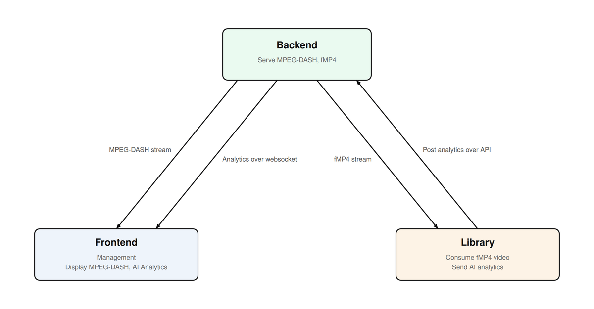
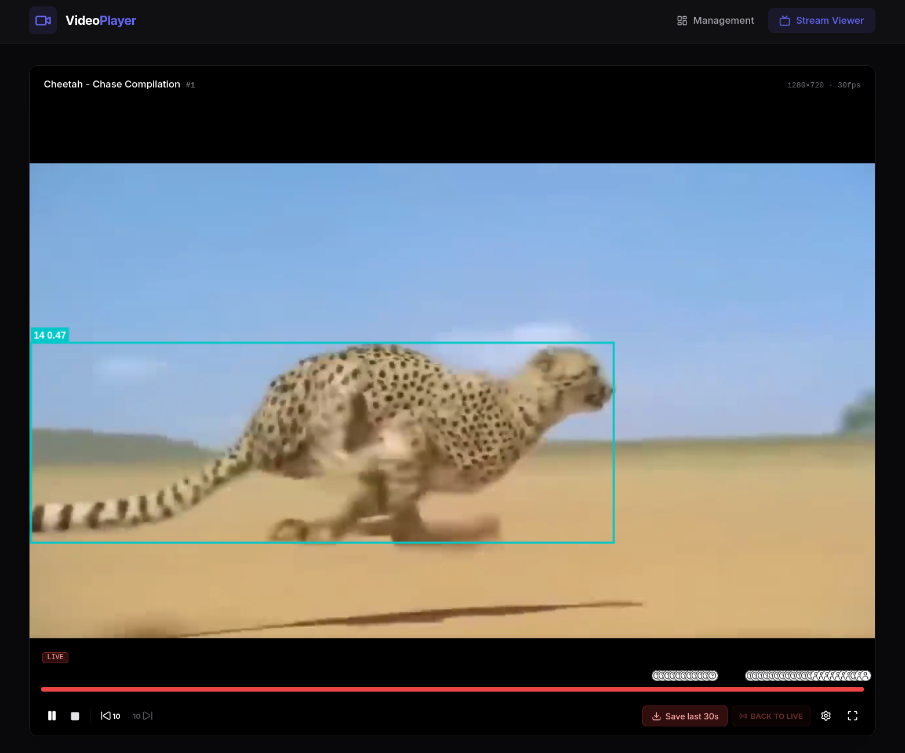

# Video Player
The following repository holds a system, that serves as a playground for Computer Vision application. The system's main features are as following:
* Distributes video streams in MPEG-DASH and fMP4 formats, for consuming video in real time and as a part of a DVR playback
* Recieves AI analytics (in form of object detection BBOXes), allowing to consume them over web-sockets in real time and display them alongside with the video, performing advance filtering like confidence-thresholds, bbox retention on screen and more

The system consists of the following components:
*  **[Backend](backend)** - Backend server that serves MPEG-DASH and fMP4 for users to consume. Allows  to send AI analytics for specific video frames - so they display on screen for all users
* **[Frontend](frontend)** - User interface for interacting with the **administrative side** of the system (Adding/removing video streams, stoping/starting playback), alongside with a **consumer side** that allows watching real-time MPEG-DASH video, displaying AI analytics on screen and giving an option to perform advance filtering and manipulation on them
* **[Library](library)** - Linux FFI shared library that allows consume video and send AI analytics from the backend server. The library is doesn't depend on a speicific programming language and can be integrated to any system.

## Prerequisites
The project requires the following to be installed in order to run:
* **Moon** - Repository task runner
* **UV** - Python package manager and runtime
* **Bun** - Javascript package manager and runtime

## Overview

