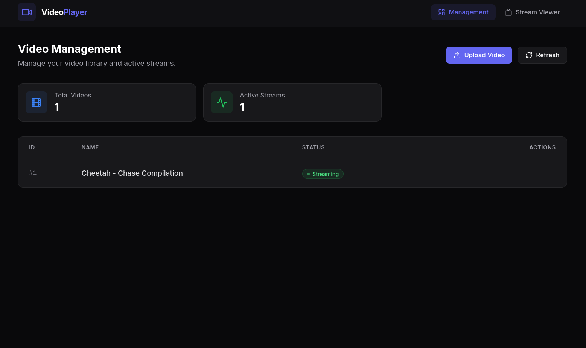

# Video Player Frontend
This folder represents a user interface (Web), allowing use to manage the backend and consume MPEG-DASH video, displaying AI analytics in real time as they arrive from the backend.<br>
The frontend consists of the following stack:

- **React** with TypeScript
- **Vite** for fast development and building
- **Tailwind CSS** for styling
- **dash.js** for DASH video playback
- **WebSocket** for real-time bbox updates

Get started by running the following command:
```bash
moon run frontend:dev
```

**NOTE** - You must create a `.env` file first

## Overview



## Management page (`/`)
- Upload videos via multipart form with live progress.
- List, inspect, and delete videos in the library.
- Start and stop streams; status badges update live via WebSocket (`Streaming` / `Initializing` / `Terminating` / `Stopped`).
- Stream info modal exposes the DASH manifest URL and progressive fMP4 URLs and other useful information about the stream.

## Viewer page (`/viewer`)
- **DASH playback with DVR** - dash.js-backed player for playing MPEG-DASH video, with a rolling DVR window, seekable timeline, "behind live" indicator, back-to-live button, and ±5s skip.
- **AI analytics overlay** - Canvas bounding-box overlay receives BBOXes from websocket events in real time and matches with frame PTS to display on screen, with a min-confidence slider and configurable retention-frames behaviour.
- **Clip export (DVR replay)** - Select a range on the timeline and export it as an MP4. BBOXes are burnt to the clip depending on whether user enabled AI analytics or not.
- **Clip export (Live recording)** - On the live edge, capture the last ~30 seconds into a rolling frame buffer and save to MP4 on demand. BBOXes are burnt to the clip depending on whether user enabled AI analytics or not.
