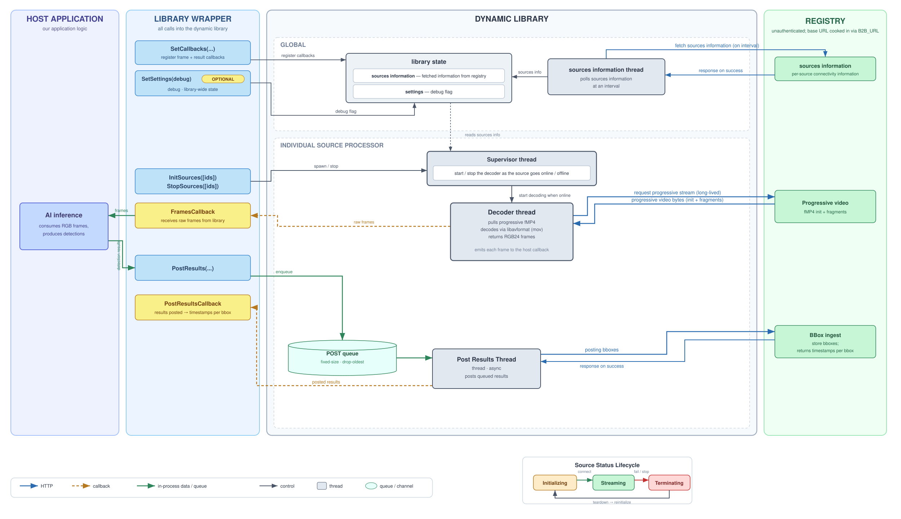

# Video Player Library
The following folder represents a dynamic linux FFI Library, that allows user to consume video (using FFmpeg 7.1.5 - LTS) in real time - recieving raw RGB24 frames, and also send AI analytics on the same exact frames back.<br>
The library is self-contained, meaning it has no dependencies or variable a user needs to set, nor it depends on any specific programming language - it can be integrated into any environment, as long as it follows the specified C functions.

The folder consists of the following:
* **Client** - Source code of the library. Written in **Rust**, allowing for parallelism while maintaining a low footprint on host's resources
* **Wrappers** - Code samples integrating the library in practice. Written in Rust/Python, show in practice how to set up the library and consume video, sending analytics back

## Architecture overview


## Delivering to third party users
The library connects directly to the backend component. In order to allow third party users to consume video on their end, we need to compile the library into a working linux dynamic library.<br>
We have 3 scripts to our use, that allow us to compile it successfully:
* **download_dependencies.sh** - Downloads all the required dependencies locally, so we can later compile the library offline. Downloads FFmpeg from source.
* **build_dependencies.sh** - Builds the dependencies from source, using the building host's architecture. This step is delicate, because we need to make sure that the compiling host has compatible versions of compilers(gcc) with the end user
* **build_library.sh** - Builds the library, setting up all the dependencies in place and all the environment variables. compiling host needs to set `B2B_URL` with the url of the backend.

**NOTE** - since we deliver the library as self contained, the url of the backend is cooked into the library itself. Changing the url would require re-compiling the library

```bash
# Downloads all the dependencies to local machine
./download_dependencies.sh

# Compile all dependencies
./build_dependencies.sh

# Build the library, with the URL cooked into it
B2B_URL=http://localhost:8702 ./build_library.sh
```
Output: `client/target/release/libclient_video.so`.
